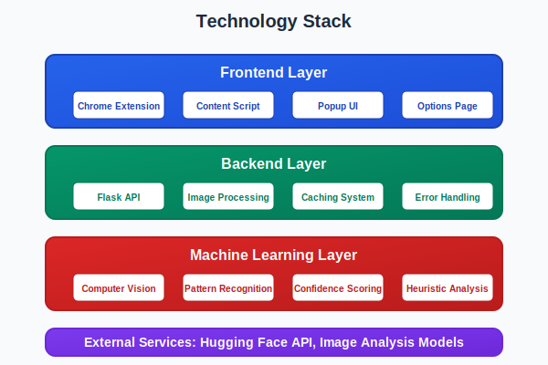
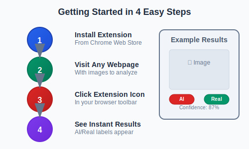

About the Project
================

What is Image AI Detector?
-------------------------

Image AI Detector is a **Chrome extension** that helps you identify whether images you see online are **real photographs** or **AI-generated content**. Think of it as a "truth detector" for images - it analyzes pictures in real-time and tells you how likely they are to be created by artificial intelligence.

.. image:: _static/images/extension-overview.svg
   :alt: Chrome extension analyzing images on a webpage
   :width: 600px
   :align: center

Why This Matters
---------------

In today's digital world, **AI-generated images** are becoming increasingly sophisticated and widespread. From social media to news websites, it's getting harder to distinguish between:

- 📸 **Real photographs** taken by cameras
- 🤖 **AI-generated images** created by tools like DALL-E, Midjourney, or Stable Diffusion

This matters because:

* **Misinformation**: AI images can be used to spread fake news
* **Trust**: We need to know what's real when making decisions
* **Transparency**: Understanding what's AI-generated helps us navigate the digital landscape
* **Education**: Learning to spot AI content is becoming an essential skill

How It Works
------------

The extension works like a smart assistant that:

1. **Scans the page** when you click the extension icon
2. **Analyzes each image** using advanced computer vision techniques
3. **Provides instant results** with confidence scores
4. **Shows detailed analysis** of what it found

.. code-block:: text

   User clicks extension
           ↓
   Extension scans page
           ↓
   Finds all images
           ↓
   Analyzes each image
           ↓
   ML model processes image
           ↓
   Returns AI/Real classification
           ↓
   Shows results with confidence
           ↓
   User sees labeled images

Key Features
------------

✅ **Real-time Analysis**
   Instant results as you browse the web

✅ **Visual Indicators**
   Clear badges and overlays on images

✅ **Confidence Scores**
   Shows how certain the AI is about its classification

✅ **Detailed Insights**
   Explains what characteristics led to the classification

✅ **Privacy-First**
   Images are analyzed locally or through secure APIs

✅ **Easy to Use**
   One-click activation, no technical knowledge required

Who Should Use This?
-------------------

🎯 **Everyone who browses the web** - From students to professionals

🎯 **Content creators** - Verify the authenticity of images before sharing

🎯 **Journalists and researchers** - Fact-check visual content

🎯 **Educators** - Teach digital literacy and media awareness

🎯 **Social media users** - Make informed decisions about what to share

🎯 **Business professionals** - Ensure marketing materials are authentic

Technology Behind the Scenes
---------------------------

While the extension is simple to use, it's powered by sophisticated technology:

**Machine Learning Models**
   Advanced AI models trained to recognize patterns in images

**Computer Vision**
   Technology that "sees" and analyzes visual content

**Real-time Processing**
   Instant analysis without slowing down your browsing

**Secure APIs**
   Professional-grade image analysis services

Privacy & Security
-----------------

🔒 **Your privacy is protected**:

* Images are analyzed securely through trusted APIs
* No personal data is stored or shared
* Analysis happens in real-time without saving images
* The extension only processes images you choose to analyze

Getting Started
--------------

Getting started is simple:

1. **Install the extension** from the Chrome Web Store
2. **Visit any webpage** with images
3. **Click the extension icon** 
4. **See instant results** with AI/Real labels

The Future of Image Verification
-------------------------------

As AI technology evolves, tools like Image AI Detector will become increasingly important. We're working on:

* **More accurate detection** of the latest AI models
* **Video analysis** capabilities
* **Batch processing** for multiple images
* **Integration** with other verification tools

This project represents a step toward a more transparent and trustworthy digital world where users can make informed decisions about the content they consume and share.

.. note::
   **Remember**: While our tool is highly accurate, no AI detection system is perfect. 
   Always use critical thinking and verify important information through multiple sources.
